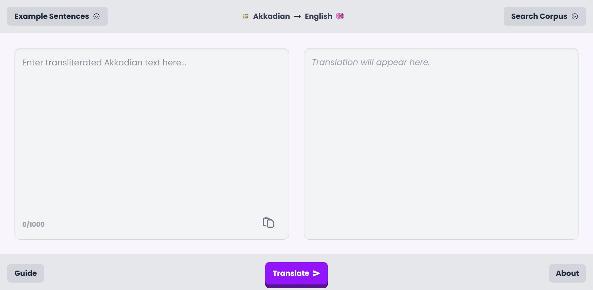

Akkadian Translator WebUI

This is an extension to my disseration assessing the performance of different transformer models in translating Akkadian. I made several models to do this, with varying parameter sizes and built from various causal and seq2seq models, they can be [found on HuggingFace](https://huggingface.co/Hippopoto0).

I thought it would be cool to make a tool that can demo a model built, in particular the MarianMT based model.

Within here, there is a `client` and `server` folder, and they are largely independant. The client can be hosted anywhere after running `npm run build`, and the server can be hosted using Docker, just ensure you change the CORS environment variable `CORS_ORIGINS` to the frontend's hosted URL.

The app allows the user to look at some example transliterations for input into the translator, but further allows for searching through the [CDLI project](https://cdli.mpiwg-berlin.mpg.de/). The translator appears to do best with official documents - perhaps inscriptions from a palace, and doesn't do as well with literary works.

If you want to try it out, go to the demo [here](https://akkadian-translator.web.app).

